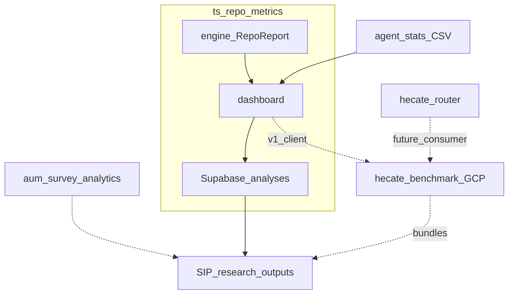

# ts-repo-metrics Project Handoff

**From:** Outgoing SIP interns (6-week program)  
**To:** Jaisree David RaviKumar, Jacob Johnston  
**Facilitator:** Scott  

Reference companion for the handoff meeting. Architecture detail: [ARCHITECTURE.md](ARCHITECTURE.md). Execution-grounded LLM routing (Hecate Router) lives in [`scottyUX/hecate-router`](https://github.com/scottyUX/hecate-router) — see that repo’s [`docs/HANDOFF.md`](https://github.com/scottyUX/hecate-router/blob/main/docs/HANDOFF.md). GCP route API board: [Hecate Router Project #6](https://github.com/users/scottyUX/projects/6).

---

## 1. Project Overview

`ts-repo-metrics` is a Tree-sitter static analysis toolchain for TypeScript/TSX repositories, plus a Next.js research dashboard. It produces a versioned `RepoReport` (complexity, smells, git history, React/TSX signals, lexical/cognitive metrics, optional pathology) used for SIP research, course workflows, and future quality scoring alongside Hecate.

It is **not** a live DistilBERT or joint semantic/structural routing gate. Hecate Stage 1 (SWE-bench Lite patch generation) is a separate Python repo; that router remains future work.

### Related repositories

| Repo | Role |
|------|------|
| [`scottyUX/ts-repo-metrics`](https://github.com/scottyUX/ts-repo-metrics) | Engine + dashboard (this repo); v1 client UX for benchmark capture |
| [`scottyUX/hecate-benchmark`](https://github.com/scottyUX/hecate-benchmark) | Immutable task-bundle capture (GCP Cloud Run Jobs + GCS; Supabase metadata) |
| [`scottyUX/agent_stats`](https://github.com/scottyUX/agent_stats) | Local agent logs → `ai_usage_trace.csv` |
| [`scottyUX/aum-survey-analytics`](https://github.com/scottyUX/aum-survey-analytics) | Qualtrics survey replication pipeline |
| [`scottyUX/hecate-router`](https://github.com/scottyUX/hecate-router) | Stage 1 patch generation + router training path; GCP `POST /v1/route` API board ([Project #6](https://github.com/users/scottyUX/projects/6)); future consumer of released bundles |

---

## 2. System Architecture Notes

| Component | Status | Notes |
|-----------|--------|-------|
| `@repo-metrics/engine` | Production | CLI + `POST /api/analyze` |
| Next.js dashboard | Production | Results tabs, AI Usage, doc review, course analyze flow |
| Supabase `analyses` | Live | `report_json`, course metadata, `ai_usage_csv`, auth/RLS |
| Git on Vercel | Retired | Zipball path removed; do not deploy Analyze here |
| Git on Railway | Required for production Analyze | Docker image includes `git` — see [`RAILWAY_DEPLOY.md`](../RAILWAY_DEPLOY.md) |
| JS/JSX support | Mid-flight | Branch `feat/issue-154-javascript-support` |
| Python support | Mid-flight | Branch `feat/python-static-analysis` |
| Pre-AI cohort re-analyze | Known gap | Some 2021 baselines previously returned 0 files — re-run before Pre/Post compare |

Schema reference: [SCHEMA.md](SCHEMA.md). AI Usage UX: [AI_USAGE_LOGS.md](AI_USAGE_LOGS.md).

---

## 3. Codebase & Environment

| Item | Value |
|------|-------|
| Remote | https://github.com/scottyUX/ts-repo-metrics |
| Board | [Project 3 — AI Driven SWE Research](https://github.com/users/scottyUX/projects/3) |
| SIP docs | [`research/`](../research/) — kickoff, sprint board setup, datasets, survey |
| Submodule / sibling | `agent_stats` → https://github.com/scottyUX/agent_stats |
| Branch conventions | `feat/`, `fix/`, `docs/`, `research/`; stories as `SIP-<sprint>.<story>` issues |

### Cloud & SaaS map

| Service | Role |
|---------|------|
| GitHub | Source, Issues, Project 3, Discussions |
| Supabase | `analyses`, `user_github_tokens`, GitHub OAuth sessions |
| Vercel | Retired for Analyze (no git binary) |
| Railway | Dashboard deploy with real git clones |
| OpenAI | Optional doc-review / coach routes |
| Qualtrics | Stage-aware AU/AUM/TAM survey exports |
| OpenRouter | **Hecate only** — not used by this dashboard |

Env names (dashboard): `NEXT_PUBLIC_SUPABASE_URL`, `NEXT_PUBLIC_SUPABASE_ANON_KEY`, `SUPABASE_SERVICE_ROLE_KEY`, `GITHUB_OAUTH_ENCRYPTION_KEY`; optional `OPENAI_API_KEY`, `GITHUB_TOKEN`. See [`apps/dashboard/.env.local.sample`](../apps/dashboard/.env.local.sample) and [`RAILWAY_DEPLOY.md`](../RAILWAY_DEPLOY.md).

---

## 4. Datasets

### 4.1 Repo metrics

- **What:** Full `RepoReport` JSON (LOC, cyclomatic/cognitive complexity, nesting, smells, git / `gitMetricsV2`, React metrics, phase3, …).
- **Where:** Supabase `public.analyses.report_json`; large local export `data/analyses_rows.csv`; backups under `backups/`.
- **Keys:** `result_id`, `repo_url`, `commit_sha`, `course_id`, `team_name`, `github_login`, `user_id`, `analyzed_at`.
- **Cadence:** On-demand Analyze (not a per-commit cron).
- **Cohorts:** Templates in [`research/datasets/templates/`](../research/datasets/templates/); Sprint 2 targets 16+16 Pre-AI / Post-AI ([#184](https://github.com/scottyUX/ts-repo-metrics/issues/184)–[#185](https://github.com/scottyUX/ts-repo-metrics/issues/185)).

### 4.2 AI logs

- **What:** Event stream from coding agents (`timestamp`, `event_type`, `session_id`, `tool_name`, optional tokens/messages).
- **Where:** `analyses.ai_usage_csv` (raw uploaded CSV text). Day-1 inventory notes: [`research/datasets/ai_logs_day1_notes.md`](../research/datasets/ai_logs_day1_notes.md).
- **Coverage:** A minority of analysis rows have AI logs uploaded; treat coverage as incomplete for Fall planning.
- **Quality:** Cursor JSONL often lacks token fields — see [`research/CURSOR_TOKEN_DISCOVERY.md`](../research/CURSOR_TOKEN_DISCOVERY.md). Uploaded `message_text` may contain sensitive content.

### 4.3 Survey results

- **Instrument:** Stage-aware AU / AUM / TAM Qualtrics (CSE115A cohorts).
- **Files:** e.g. `data/survey_CSE115A-C_Spring2026_2026-06-23.csv`; raw exports may also live under gitignored `research/survey/data/raw/`.
- **Pipeline:** [`scottyUX/aum-survey-analytics`](https://github.com/scottyUX/aum-survey-analytics) — see [`research/survey/README.md`](../research/survey/README.md).
- **Linkage:** `ResponseId`, `GitHub Handle`, `Team Repo URL`, `Consent` — **IRB-sensitive**; handle subject-ID mapping per protocol only.

---

## 5. Cursor / AI Logs Extractor

- **Repo:** [`scottyUX/agent_stats`](https://github.com/scottyUX/agent_stats) (clone or submodule at `agent_stats/`). Setup: [`research/AGENT_STATS_SETUP.md`](../research/AGENT_STATS_SETUP.md).
- **Flow:** Dashboard AI Usage tab → copy platform prompt → run export with `--messages --tokens` → upload CSV → persist on `result_id`.
- **Agents:** Cursor, Claude Code, Codex, Gemini — paths in [AI_USAGE_LOGS.md](AI_USAGE_LOGS.md).
- **Fragility:** Cursor nested schema and log-path drift; transcript JSONL has no billing tokens (SQLite / account CSV are alternate sources). Keep dashboard prompts synced with parser changes via submodule bumps.
- **Fall cohort:** Point new students at the AI Usage prompts; filter by repo slug; ensure course allow-list / `course_id` tags match the new term before scale-up.

---

## 6. Systematic Literature Review

PDFs and notes under [`research/papers/`](../research/papers/) (code quality, LLM routing, SWE-rebench, stage-aware AI usage). Recent additions arrived via research PRs on `main`. Hecate Router keeps a parallel set under `hecate-router/literature/`. Prefer updating both when a source is shared across routing and education metrics work.

---

## 7. IRB & Privacy

- Survey: Qualtrics `Consent` and demographics/GitHub fields — highest sensitivity; subject-ID mapping per IRB only.
- Dashboard: [`/privacy`](../apps/dashboard/app/privacy/page.tsx) and [`/terms`](../apps/dashboard/app/terms/page.tsx) describe anonymized aggregate research use and voluntary opt-out.
- AI CSV uploads may include prompt text — **do not assume** regex scrubbing ran before storage.
- Confirm exemption scope, scrubbing SOP (if any), and opt-out operations with Scott before Fall scale-up.

---

## 8. Access & Credentials Handoff — Incoming (Jaisree David RaviKumar, Jacob Johnston)

- [ ] GitHub: `ts-repo-metrics`, `agent_stats`, `aum-survey-analytics` + Project 3 board
- [ ] Supabase project access (prefer read-only first; service role only if required)
- [ ] Vercel and/or Railway dashboard deploy access (Scott owns billing)
- [ ] Qualtrics / survey drive + subject-ID mapping key (IRB protocol)
- [ ] Shared docs / Slack or Discord channels
- [ ] Cross-repo: `hecate-router` + **new** OpenRouter key if they also own Stage 1 (see Hecate Router handoff)
- [ ] Cursor seat if lab-paid seats are used for extractor work

**Sequencing:** Verify clone, `npm test`, and dashboard sign-in for Jaisree David RaviKumar and Jacob Johnston before revoking outgoing access (Section 9).

---

## 9. Intern Off-boarding — Revoke Access & Transfer/Cancel Licenses (Outgoing)

Complete the same day as the handoff meeting once Section 8 is verified.

### Outgoing contributors (this ecosystem)

| Person | Primary contributions |
|--------|------------------------|
| Joshua Cao | AI Usage dashboard, Cursor paths/tests, `result_id` / versioning, lockfile/CI, `agent_stats` bumps |
| Luna Wang | Cursor nested parser, per-user AI usage CSV / RLS design, versioning |
| Asin Pancholi | SIP 1.7 AI log inventory/discovery; Sprint 2 cohort shortlist/manifest |
| Timothy Tran | SIP-1.2 survey replication; cohort manifest / Pre–Post comparison work |
| Bryan Zhang | Sprint 2 board assignee; also Hecate S6 prompt work |
| Miguel Zavala | Engine cache/sync fixes (#103) |

### Checklist

**Repo & code**
- [ ] Remove as GitHub collaborator / org-team; revoke PATs or deploy keys they generated
- [ ] Confirm WIP branches (`feat/python-static-analysis`, `feat/issue-154-javascript-support`, etc.) are merged or reassigned
- [ ] Rotate shared secrets they had (Supabase service role, `GITHUB_OAUTH_ENCRYPTION_KEY`, `.env` values) if not fully replaced for incoming researchers

**API keys & compute**
- [ ] Revoke any individually issued OpenAI / GitHub tokens used for dashboard work
- [ ] Remove Vercel / Railway / Supabase memberships

**Data & storage**
- [ ] Remove access to analyses DB / exports containing `ai_usage_csv` or survey CSVs
- [ ] Remove survey subject-ID mapping access (IRB-sensitive)
- [ ] Remove from shared drives with datasets or PII

**Tools & communications**
- [ ] Cursor / Qualtrics / other paid seats — transfer or remove
- [ ] Slack/Discord, mailing lists, calendars
- [ ] Confirm no personal payment method on lab subscriptions

**Sign-off**
- [ ] Scott confirms each outgoing intern’s access has been revoked
- [ ] Outgoing interns confirm hand-over of local-only notes
- [ ] Jaisree David RaviKumar and Jacob Johnston confirm fresh login/clone/pull succeeds
